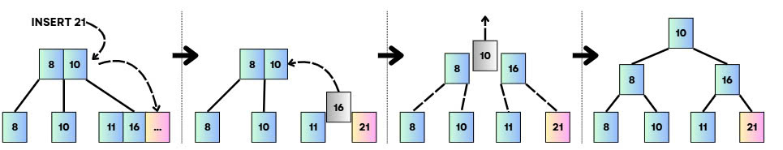
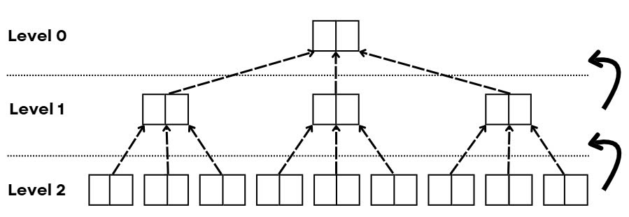
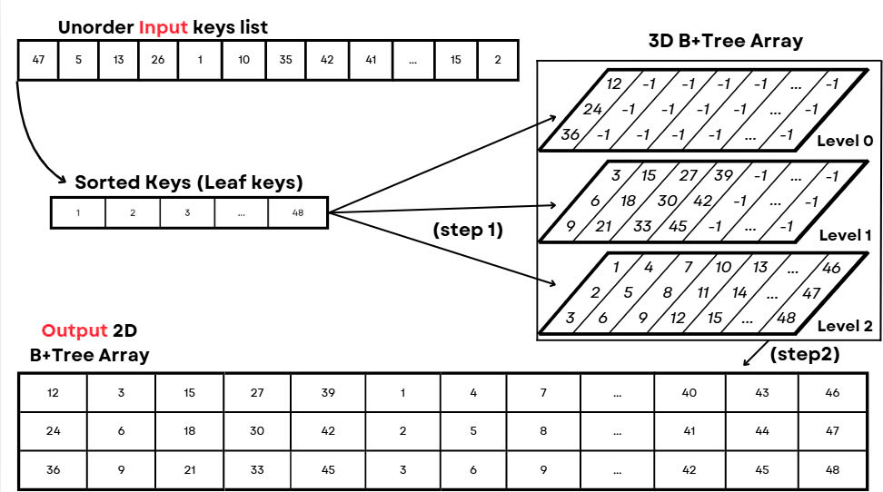

# A New Construction Method for B+-tree Data Structure with GPGPU

This repository contains the implementation and experimental results of our research on accelerating B+-tree construction using General-Purpose Computing on Graphics Processing Units (GPGPU).

## Introduction

The B+-tree data structure plays a crucial role in data storage and retrieval. However, traditional methods of constructing B+-trees face significant challenges when handling large datasets due to their high time complexity. Our research proposes a novel method to accelerate B+-tree construction on large datasets using GPGPU. The method fully parallelizes the insertion operation, surpassing CPU-based methods in both efficiency and scalability.

## Main Contributions

1. **Novel GPU-based Insertion Method**
   - Developed a new parallel insertion algorithm specifically optimized for GPU architecture
   - Implemented hybrid representation that optimizes both performance and memory usage
   - Achieved complete parallelization of the insertion process

2. **Performance Optimization**
   - Eliminated synchronization overhead from level-based methods
   - Reduced insertion complexity to O(1) for GPU-based insertion
   - Enhanced throughput construction through conflict-free computation

3. **Memory Efficiency**
   - Designed hybrid data structure for optimal memory usage
   - Implemented efficient conversion between 3D and 2D array representations
   - Optimized memory access patterns for GPU architecture

## Implementation Methods

### 1. CPU Top-down Approach (TopDownCPU.py)
- Traditional sequential insertion
- Traverses from root to leaf for each key
- Suitable for small datasets



*Figure 1: CPU top-down Insertion*

### 2. CPU Bottom-up Approach (BottomUpCPU.py)
- Builds tree from leaf level upward
- Improved efficiency over top-down approach
- Better performance for medium-sized datasets



*Figure 2: CPU bottom-up Insertion*

### 3. GPU-based Approach (LeafBasedGPU.py)
- Novel parallel construction method
- Fully utilizes GPU capabilities
- Optimal for large-scale datasets
- Features four distinct CUDA kernels:
  - Reshape 1D to 2D arrays
  - Parallel 3D tree construction
  - Leaf node copying
  - 3D to 2D array conversion



*Figure 3: Leaf-based Parallel Insertion*
## Experimental Results

### Test Environment
- CPU: Intel i5-8365U (4 cores)
- GPU: NVIDIA Tesla T4 (2560 CUDA cores)
- CUDA Compiler: NVIDIA CUDA Compiler

### Performance Analysis

1. **Small Datasets (10-50MB)**
   - GPU method maintains sub-second processing times
   - CPU top-down: ~55.05 seconds for 50MB
   - CPU bottom-up: ~7.13 seconds for 50MB
   - GPU method: <1 second consistently

2. **Large Datasets (100-2000MB)**
   - Significant performance gap widens with dataset size
   - CPU top-down: 1715.89 seconds for 1000MB
   - CPU bottom-up: 436.83 seconds for 1000MB
   - GPU method: 9.62 seconds for 1000MB
   - 178x speedup achieved for 1GB datasets

3. **Scalability**
   - GPU method shows linear scaling with dataset size
   - Maintains efficient performance even at 2000MB
   - CPU methods show exponential time increase

## Requirements

### Hardware
- CUDA-capable GPU
- Minimum 8GB RAM
- Multi-core CPU

### Software
- CUDA Toolkit
- Python 3.7+
- Required libraries:
  ```
  cupy
  numpy
  ```

## Dataset Access

Test datasets are available at: [Google Drive](https://drive.google.com/drive/folders/1spZEsHRPGPN_ttKj-EJUhwIO21-kQ_YS?usp=sharing)

## Usage

1. Clone the repository:
```bash
git clone https://github.com/username/b-plus-tree-gpgpu.git
cd b-plus-tree-gpgpu
```

2. Install dependencies:
```bash
pip install -r requirements.txt
```

3. Run experiments:
```bash
# For GPU implementation
python src/LeafBasedGPU.py

# For CPU implementations
python src/BottomUpCPU.py
python src/TopDownCPU.py
```

## Future Work

- Improve handling of imperfect datasets
- Optimize memory management further
- Extend support for dynamic updates
- Investigate hybrid CPU-GPU approaches

## Authors

- Nguyen Minh Tri (chinjsu130205@gmail.com)
- Khuu Trong Quan (khuutrongquan220405@gmail.com)
- Huynh Cong Viet Ngu* (nguhcv@fe.edu.vn)

Department of Computing Fundamental, FPT University, Ho Chi Minh, Vietnam

\* Corresponding author

## License

This project is licensed under the MIT License - see the LICENSE file for details.
