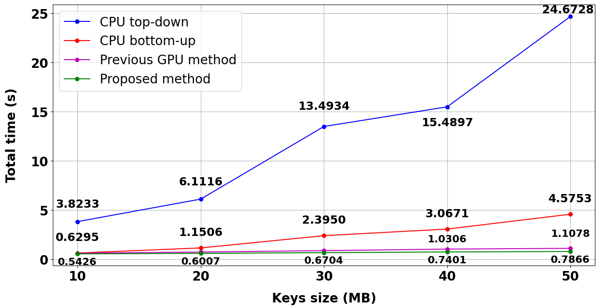
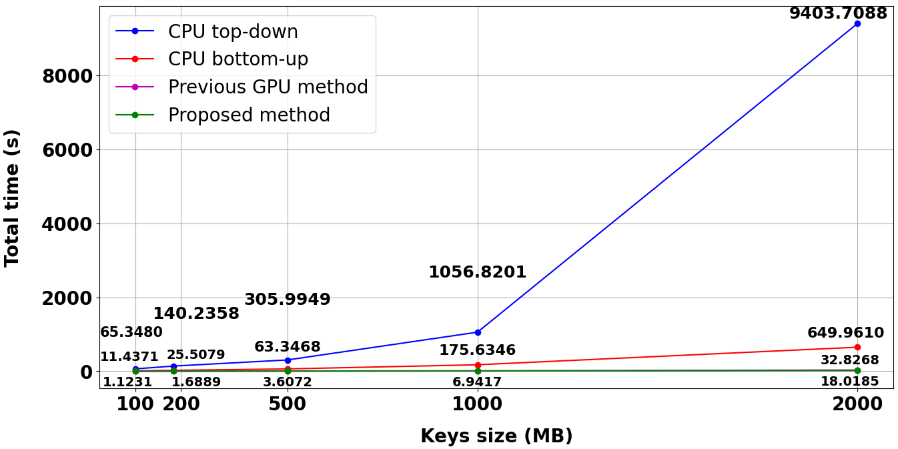

# A New Construction Method for B+-tree Data Structure with GPGPU

This repository contains the implementation and experimental results of our research on accelerating B+-tree construction using General-Purpose Computing on Graphics Processing Units (GPGPU).

## Introduction

The B+-tree data structure plays a crucial role in data storage and retrieval. However, traditional methods of constructing B+-trees face significant challenges when handling large datasets due to their high time complexity. Additionally, previous GPU methods could not fully improve tree construction performance with massive datasets. Therefore, our research proposes a novel method to accelerate B+-tree construction on large datasets using GPGPU. The method fully parallelizes the insertion operation, surpassing CPU-based methods and the previous GPU-based method in both efficiency and scalability.

## Main Contributions

1. **Novel GPU-based Construction Method**
   - Developed a new parallel insertion algorithm specifically optimized for GPU architecture.
   - Achieve 521.9x, 36.1x, 1.8x time respectively speedup to CPU top-down for 2000MB dataset.
2. **Three steps for Proposed Solution**
   - Sort by CuPy sort (from Cupy library).
   - Insertion into the 3D Tree Array (Proposed Construction method).
   - Conversion from 3D Array to 2D Representation (Our Method's optimization).
3. **Core techniques of our Method**
   - Using Arrays instead Linked list.
   - Proposing new formula to calculate index position for every key in the B+-tree simutaneously using GPGPU's kernel.
   - Converting 3D representaion into 2D in parallel using GPU's kernel.

## Implementation Methods

### 1. CPU Top-down Approach ([TopDownCPU.py](Source/TopDownCPU.py))
- Traditional sequential insertion.
- Traverses from root to leaf for each key.
- Suitable for small datasets.


### 2. CPU Bottom-up Approach ([BottomUpCPU.py](Source/BottomUpCPU.py))
- Builds tree from leaf level upward, sequentially as visualized as each dashed arrows.
- Improved efficiency over top-down approach.
- Better performance for medium-sized datasets.


### 3. Previous GPU-based approach ([PreviousGPU.py](Source/PreviousGPU.py))
- Builds tree bottom up from leaf level, level by level as shown as the curved arrows.
- Parallel at each level but sequential in total.


### 4. GPU-based Approach ([ProposedMethod.py](Source/ProposedMethod.py))
- Novel parallel construction method.
- Fully utilizes GPU capabilities.
- Optimal for large-scale datasets.
- Features two distinct CUDA kernels:
  - Parallel 3D tree construction.
  - 3D to 2D array conversion.


## Experimental Results

### Test Environment
- CPU: AMD Ryzen 7 7435HS (16 cores, 3.1GHz).
- GPU: NVIDIA GeForce RTX 4060 GPU (3072 CUDA cores, 8GB VRam GDDR6).
- CUDA Compiler: NVIDIA CUDA Compiler.

### Performance Analysis
1. **Datasets**
- Input datasets for testing consist of ten synthetic datasets with sizes ranging from 10MB to 2000MB, with appropriate keys and orders.


2. **Small Datasets (10-50MB)**
   - GPU method maintains sub-second processing times.
   - CPU top-down: ~24.67 seconds for 50MB.
   - CPU bottom-up: ~4.58 seconds for 50MB.
   - Previous GPU method: >1 second for 50MB.
   - Proposed GPU method: <1 second consistently.



3. **Large Datasets (100-2000MB)**
   - Significant performance gap widens with dataset size.
   - CPU top-down: 9403.71 seconds for 2000MB.
   - CPU bottom-up: 649.96 seconds for 2000MB.
   - Previous GPU method: 32.83 seconds for 2000MB.
   - Proposed GPU method: 18.02 seconds for 2000MB.
   


4. **Scalability**
   - GPU method shows linear scaling with dataset size.
   - Maintains efficient performance even at 2000MB.
   - CPU methods show exponential time increase.

## Ablation Study
This section presents a comprehensive evaluation of the
proposed solution across different GPU architectures including
NVIDIA GeForce RTX 3060 GPU (3840 CUDA cores, 6GB
VRam GDDR6), NVIDIA GeForce RTX 4050 GPU (2560
CUDA cores, 6GB VRam GDDR6) and NVIDIA GeForce
RTX 4060 GPU (3072 CUDA cores, 8GB VRam GDDR6).


## Appendix
### Detaild Results
COMPLETE EXPERIMENTAL DATA TABLE FROM 10MB TO 50MB.<br>
LIGHT YELLOW: THE AVERAGE VALUE OF SIX RUNS.<br>
LIGHT GREEN: THE TOTAL TIME OF THE FIVE GPU’S FACTOR.<br>
LIGHT ORANGE: THE STANDARD DEVIATION OF THE AVERAGE VALUE<br>


COMPLETE EXPERIMENTAL DATA TABLE FROM 100MB TO 2000MB.<br>
LIGHT YELLOW: THE AVERAGE VALUE OF SIX RUNS.<br>
LIGHT GREEN: THE TOTAL TIME OF THE FIVE GPU’S FACTOR.<br>
LIGHT ORANGE: THE STANDARD DEVIATION OF THE AVERAGE VALUE.<br>

## Requirements

### Hardware
- CUDA-capable GPU
- Minimum 6GB RAM

### Software
- CUDA Toolkit
- Python 3.7+
- Required libraries:
  ```
  cupy
  numpy
  numba
  math
  csv
  time
  bisect
  ```

## Dataset Access

Test datasets are available at: [Google Drive](https://drive.google.com/drive/folders/1spZEsHRPGPN_ttKj-EJUhwIO21-kQ_YS?usp=sharing)

## Usage

1. Clone the repository:
```bash
git clone https://github.com/mintii13/A_New_Construction_Method_for_BPTree_with_GPGPU.git
cd b-plus-tree-gpgpu
```
2. Download the dataset

3. Install dependencies:
```bash
pip install -r requirements.txt
```

4. Run experiments (edit the file_path and corresponding key):
```bash
# For GPU implementation
python src/LeafBasedGPU.py
python src/PreviousGPU.py

# For CPU implementations
python src/BottomUpCPU.py
python src/TopDownCPU.py
```


## Authors

- Nguyen Minh Tri (minhtringuyen130205@gmail.com)
- Khuu Trong Quan (khuutrongquan220405@gmail.com)
- Huynh Cong Viet Ngu* (nguhcv@fe.edu.vn)

Department of Computing Fundamental, FPT University, Ho Chi Minh, Vietnam

\* Corresponding author

## License

This project is licensed under the MIT License - see the LICENSE file for details.
